## System Specs

2.4 GHz 8-Core Intel Core i9\
L2 Cache (per Core): 256 KB\
L3 Cache:	16 MB\
32 GB 2667 MHz DDR4\
Apple SSD AP0512N 512 GB\
Hyperthreading: *Off*

## Baseline C# Runtime

234,833ms (234.833s, 3m54s)\
7.47 GB in LOH\
GC time is ~17.5% of total time (41,096ms)\

## Pre-allocate Temperature List

233,307ms (233.307s, 3m53s) - 0.65% improvement over baseline

## Read into blocks of char arrays

253,976ms (253.976s, 4m14s) - 8.2% slower than baseline\
GC time is ~17.3% of total time (43,938ms)

## Read into blocks of byte arrays

372,823ms (372.823s, 6m13s) - 58.8% slower than baseline\
GC time is ~23% of total time (85,749ms)

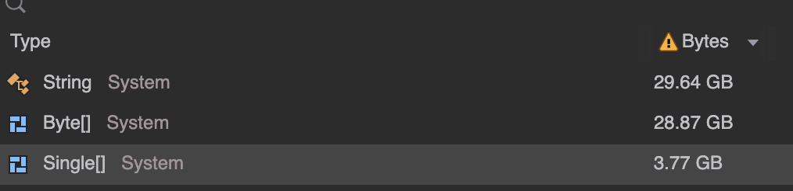

## Read into blocks of byte spans

199,262ms (199.262s, 3m19s) - 15.1% improvement over baseline\
GC time is ~13% of total time (25,904ms)

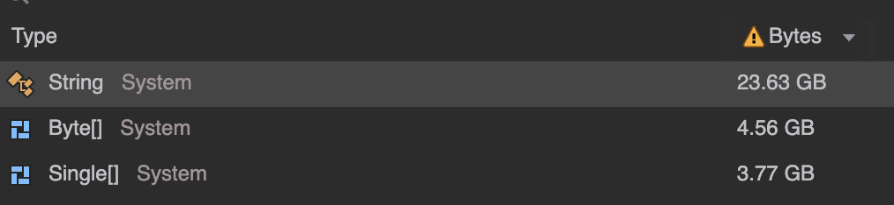

## Read into blocks of char spans

166,898ms (166.898s, 2m46s) - 29.1% improvement over baseline\
GC time is ~7% of total time (11,683ms)

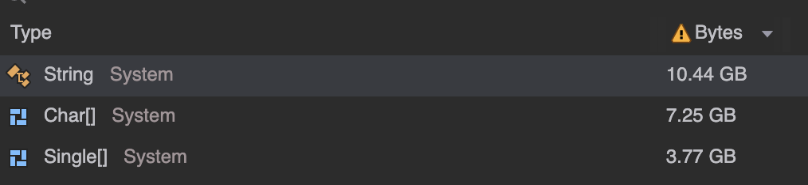

## Calculate temperature statistics on the fly

231,824ms (231.824s, 3m51s) - 1.3% improvement over baseline\
Heap bounces between 380 MB and 770 MB in LOH\
GC time is ~6.7% of total time (15,532ms)

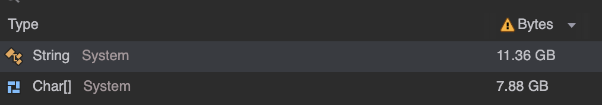

Benchmark of `TryGetValue` + `Add` on `SortedDictionary` vs `Dictionary`:

| Method                        | Mean      | Error    | StdDev   | Ratio | Gen0   | Gen1   | Allocated | Alloc Ratio |
|------------------------------ |----------:|---------:|---------:|------:|-------:|-------:|----------:|------------:|
| TryGetValue_SortedDictionary  | 108.24 us | 1.934 us | 1.809 us |  1.00 | 2.6855 | 0.1221 |   22.7 KB |        1.00 |
| TryGetValue_RegularDictionary |  13.77 us | 0.262 us | 0.367 us |  0.13 | 2.6550 |      - |  21.79 KB |        0.96 |

## Use Dictionary over SortedDictionary when gathering data

154,939ms (154.939s, 2m34s) - 34.1% improvement over baseline

## Use custom temperature parsing

95,168ms (95.168s, 1m35s) - 59.4% improvement over baseline

## Rent array blocks instead of allocating new ones

Before:
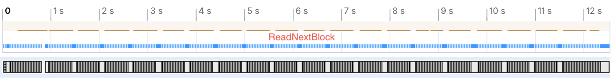
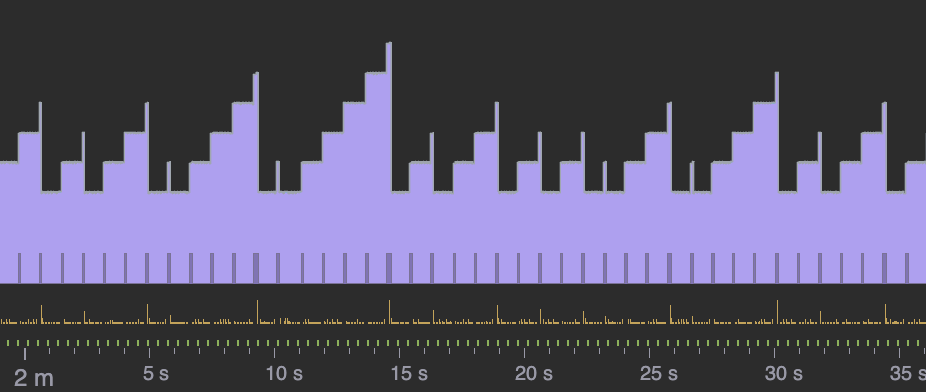

Heap bounces between 390 MB and 1.26 GB in LOH\
GC time is 13.4% of total time (12,753ms)

After:
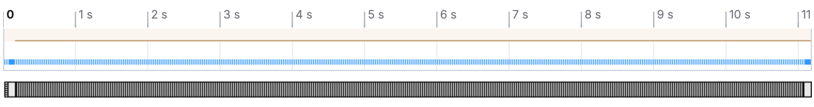
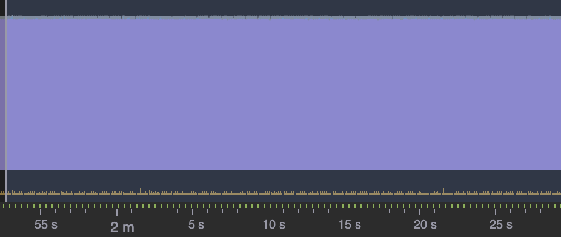

82,026ms (82.026s, 1m22s) - 65.1% improvement over baseline\
Heap stays constant around 390 MB in LOH\
GC time is 15.2% of total time (12,468ms)

## Process each block in parallel

(21192ms + 19334ms + 20424ms) / 3 = 20316.67ms (20.31667s, 20s) - 91.3% improvement over baseline\

Heap grows to 20 GB in LOH\
GC time is 57.3% of total time (13,374ms)

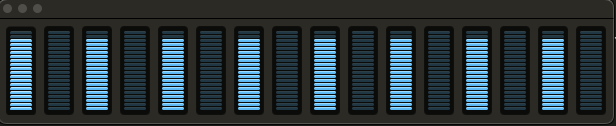
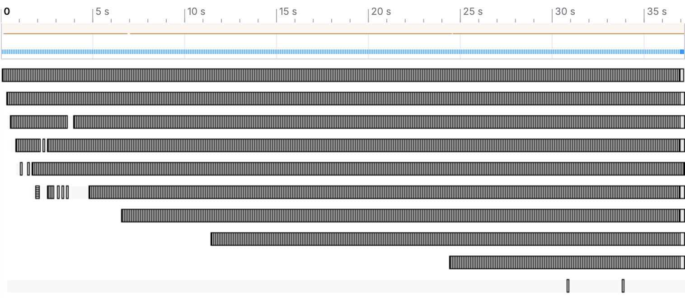
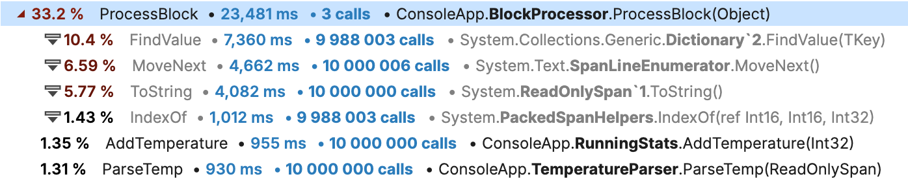
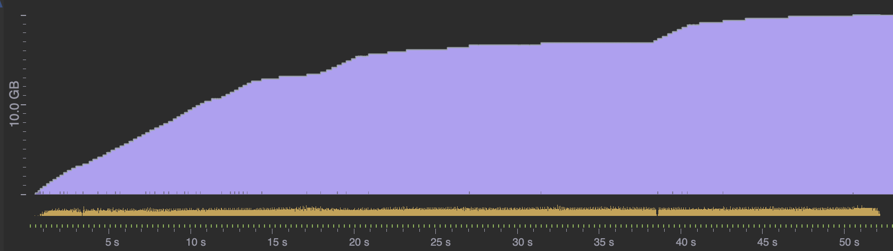
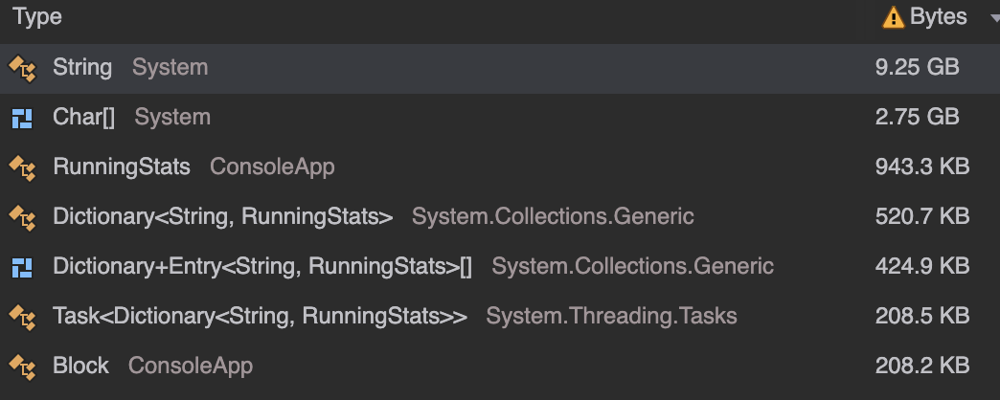

## Use custom Dictionary to prevent String creations

(19243ms + 18763ms + 19988ms) / 3 = 19331ms (19.331s, 19s) - 91.8% improvement over baseline\

Heap grows to 8.14 GB in LOH\
GC time is 0.25% of total time (48ms)

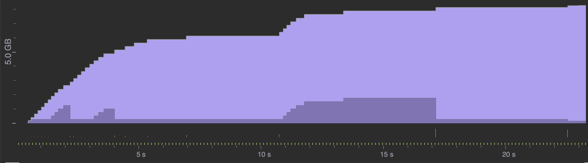
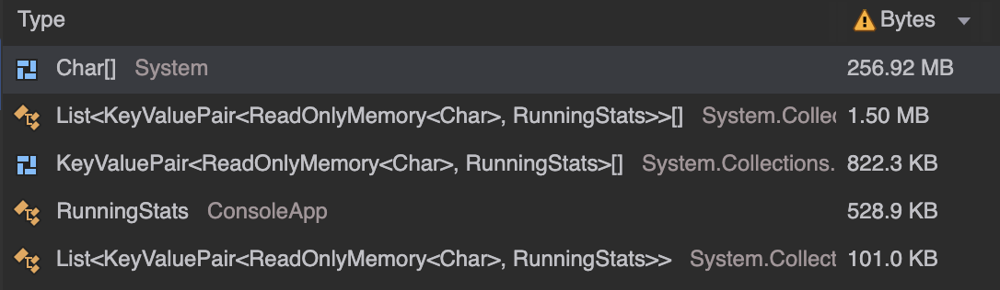

## Read into blocks of byte spans (Attempt 2)

(11539ms + 11339ms + 11762ms) / 3 = 11547ms (11.5s) - 95.1% improvement over baseline\
Heap grows to 8.65 GB in LOH\
GC time is 0.65% of total time (60ms)

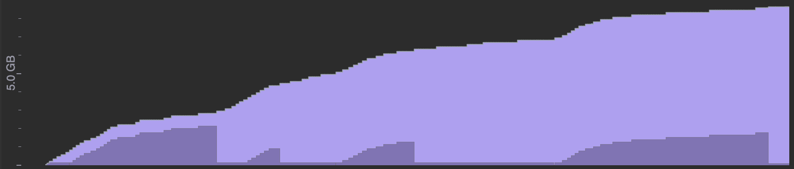

## Read blocks in parallel, use unmanaged memory, merge stats as tasks complete

(8602ms + 9017ms + 9019ms) / 3 = 8879.33ms (8.88s) - 96.2% improvement over baseline\
Heap grows to 1.35 GB in unmanaged memory\
GC time is 0.38% of total time (33.7ms)

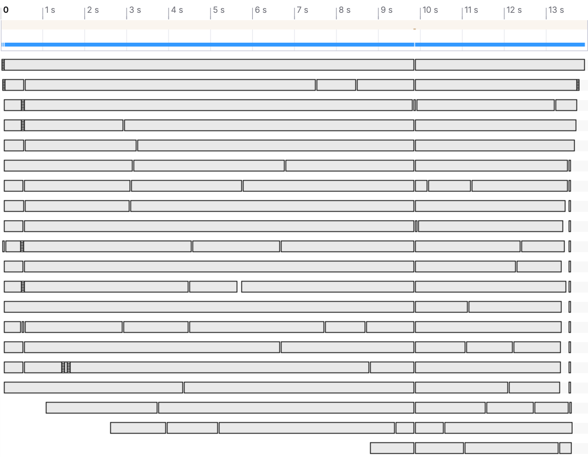
