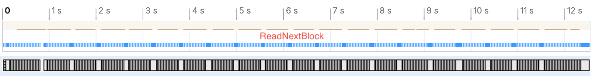

## System Specs

2.4 GHz 8-Core Intel Core i9\
L2 Cache (per Core): 256 KB\
L3 Cache:	16 MB\
32 GB 2667 MHz DDR4\
Apple SSD AP0512N 512 GB\
Hyperthreading: *Off*

## Baseline C# Runtime

260,985ms (260.985s, 4.35m)
7.47 GB in LOH
GC time is ~17.5% of total time

## Pre-allocate Temperature List

253,037ms (253.037s, 4.22m) - 3.05% improvement over baseline

## Read into blocks of char arrays

285,698ms (285.698s, 4.76m) - 9.5% slower than baseline
GC time is ~17.3% of total time

## Read into blocks of byte arrays

406,350ms (406.350s, 6.77m) - 55.7% slower than baseline
GC time is ~23% of total time

## Read into blocks of byte spans

210,162ms (210.162, 3.5m) - 19.5% improvement over baseline
GC time is ~13% of total time

## Read into blocks of char spans

187,307ms (187.307s, 3.12m) - 28% improvement over baseline
GC time is ~7% of total time (11,683ms)

## Calculate temperature statistics on the fly

244,068ms (244.068s, 4.07m) - 6.4% slower than baseline
Heap bounces between 380 MB and 770 MB in LOH
GC time is ~6.7% of total time (15,532ms)

Benchmark of `TryGetValue` + `Add` on `SortedDictionary` vs `Dictionary`:

| Method                        | Mean      | Error    | StdDev   | Ratio | Gen0   | Gen1   | Allocated | Alloc Ratio |
|------------------------------ |----------:|---------:|---------:|------:|-------:|-------:|----------:|------------:|
| TryGetValue_SortedDictionary  | 108.24 us | 1.934 us | 1.809 us |  1.00 | 2.6855 | 0.1221 |   22.7 KB |        1.00 |
| TryGetValue_RegularDictionary |  13.77 us | 0.262 us | 0.367 us |  0.13 | 2.6550 |      - |  21.79 KB |        0.96 |

## Use Dictionary over SortedDictionary when gathering data

160,849ms (160.849s, 2.68m) - 38.4% improvement over baseline

## Use custom temperature parsing

101,504ms (101.504s, 1.69m) - 61.1% improvement over baseline

## Rent array blocks instead of allocating new ones

Before:

Heap bounces between 390 MB and 1.26 GB in LOH\
GC time is 13.4% of total time (12,753ms)

After:

86,636ms (86.636s, 1.44m) - 66.8% improvement over baseline\
Heap stays constant around 390 MB in LOH\
GC time is 15.2% of total time (12,468ms)

## Process each block in parallel

(23,002ms + 21,308ms + 23,766ms) / 3 = 22,692ms (22.7s) - 91.3% improvement over baseline

Heap grows to 20 GB in LOH\
GC time is 57.3% of total time (13,374ms)

## Use custom Dictionary to prevent String creations

(20,502ms + 17,337ms + 18,607ms) / 3 = 18,815ms (18.8s) - 92.8% improvement over baseline

Heap grows to 8.14 GB in LOH\
GC time is 0.25% of total time (48ms)

## Read into blocks of byte spans (Attempt 2)

(10,942ms + 11,685ms + 11,265ms) / 3 = 11,297ms (11.3s) - 95.7% improvement over baseline
GC time is 0.65% of total time (60ms)

