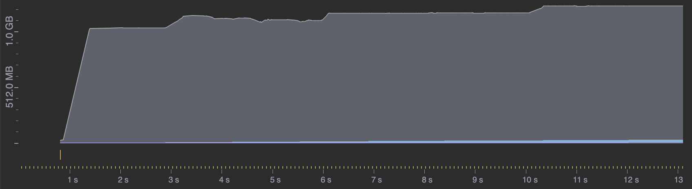

## System Specs

2.4 GHz 8-Core Intel Core i9\
L2 Cache (per Core): 256 KB\
L3 Cache:	16 MB\
32 GB 2667 MHz DDR4\
Apple SSD AP0512N 512 GB\
Hyperthreading: *Off*

## Baseline C# Runtime

260,985ms (260.985s, 4.35m)
7.47 GB in LOH
GC time is ~17.5% of total time

## Pre-allocate Temperature List

253,037ms (253.037s, 4.22m) - 3.05% improvement over baseline

## Read into blocks of char arrays

285,698ms (285.698s, 4.76m) - 9.5% slower than baseline
GC time is ~17.3% of total time

## Read into blocks of byte arrays

406,350ms (406.350s, 6.77m) - 55.7% slower than baseline
GC time is ~23% of total time

## Read into blocks of byte spans

210,162ms (210.162, 3.5m) - 19.5% improvement over baseline
GC time is ~13% of total time

## Read into blocks of char spans

187,307ms (187.307s, 3.12m) - 28% improvement over baseline
GC time is ~7% of total time (11,683ms)

## Calculate temperature statistics on the fly

244,068ms (244.068s, 4.07m) - 6.4% slower than baseline
Heap bounces between 380 MB and 770 MB in LOH
GC time is ~6.7% of total time (15,532ms)

Benchmark of `TryGetValue` + `Add` on `SortedDictionary` vs `Dictionary`:

| Method                        | Mean      | Error    | StdDev   | Ratio | Gen0   | Gen1   | Allocated | Alloc Ratio |
|------------------------------ |----------:|---------:|---------:|------:|-------:|-------:|----------:|------------:|
| TryGetValue_SortedDictionary  | 108.24 us | 1.934 us | 1.809 us |  1.00 | 2.6855 | 0.1221 |   22.7 KB |        1.00 |
| TryGetValue_RegularDictionary |  13.77 us | 0.262 us | 0.367 us |  0.13 | 2.6550 |      - |  21.79 KB |        0.96 |

## Use Dictionary over SortedDictionary when gathering data

160,849ms (160.849s, 2.68m) - 38.4% improvement over baseline

## Use custom temperature parsing

101,504ms (101.504s, 1.69m) - 61.1% improvement over baseline

## Rent array blocks instead of allocating new ones

Before:

Heap bounces between 390 MB and 1.26 GB in LOH\
GC time is 13.4% of total time (12,753ms)

After:

86,636ms (86.636s, 1.44m) - 66.8% improvement over baseline\
Heap stays constant around 390 MB in LOH\
GC time is 15.2% of total time (12,468ms)

## Process each block in parallel

(23,002ms + 21,308ms + 23,766ms) / 3 = 22,692ms (22.7s) - 91.3% improvement over baseline

Heap grows to 20 GB in LOH\
GC time is 57.3% of total time (13,374ms)

## Use custom Dictionary to prevent String creations

(17,561ms + 17,372ms + 16,452ms) / 3 = 17,128ms (17.1s) - 93.4% improvement over baseline

Heap grows to 8.14 GB in LOH\
GC time is 0.25% of total time (48ms)

## Read into blocks of byte spans (Attempt 2)

(10,942ms + 11,685ms + 11,265ms) / 3 = 11,297ms (11.3s) - 95.7% improvement over baseline
GC time is 0.65% of total time (60ms)

## Read blocks in parallel, use unmanaged memory, merge stats as tasks complete, use better hash table

(8,066ms + 8,014ms + 8,075ms) / 3 = 8,051.67ms (8s) - 96.6% improvement over baseline\
Heap grows to 1.35 GB in unmanaged memory\
GC time is 0.38% of total time (33.7ms)

## Run with 10K unique city names

Baseline: 364,729ms (364.7s, 6m5s)\
Final optimizations: 27,388ms (27.4s) - 92.5% improvement over baseline

## GCP VM Testing

| VM Machine Type | OS                  | CPU                       | RAM   | HDD Type | Run 1  | Run 2  | Run 3  | Run 4  | Run 5  | Avg (ms) | Avg (s) | $ / mo   | Compute Cost |
|-----------------|---------------------|---------------------------|-------|----------|--------|--------|--------|--------|--------|----------|---------|----------|--------------|
| N2D             | Ubuntu 22.04        | AMD EPYC Milan (2.45 GHz) | 64 GB | Balanced | 6845ms | 6923ms | 6918ms | 6936ms | 6848ms | 6894.0   | 6.89    | $508.43  | $0.0001110   |
| N2D             | Windows Server 2022 | AMD EPYC Milan (2.45 GHz) | 64 GB | Balanced | 5309ms | 5325ms | 5348ms | 5344ms | 5651ms | 5395.4   | 5.40    | $1045.71 | $0.0001789   |
| C3D             | Ubuntu 22.04        | AMD EPYC Genoa (2.6 GHz)  | 64 GB | Balanced | 6228ms | 6318ms | 6264ms | 6240ms | 6242ms | 6258.4   | 6.26    | $545.26  | $0.0001082   |
| C3D             | Windows Server 2022 | AMD EPYC Genoa (2.6 GHz)  | 64 GB | Balanced | 5170ms | 5159ms | 5047ms | 5056ms | 5078ms | 5102.0   | 5.10    | $1082.54 | $0.0001749   |

Windows is 21.7% faster than Ubuntu on N2D, 18.5% faster on C3D.

## My Solution vs. Fastest Solution (using Hyperfine)

| Solution | SMT | Time (s) |
|----------|-----|----------|
| Mine     | Off | 8.689    |
| Fastest  | Off | 2.814    |
| Mine     | On  | 6.924    |
| Fastest  | On  | 2.069    |

## My Solution - JIT vs. AOT (using Hyperfine)

| Method | SMT | Time (s) |
|--------|-----|----------|
| JIT    | Off | 8.689    |
| AOT    | Off | 11.126   |
| JIT    | On  | 6.924    |
| AOT    | On  | 7.293    |
