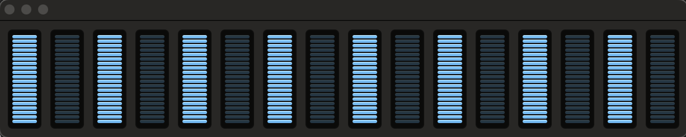
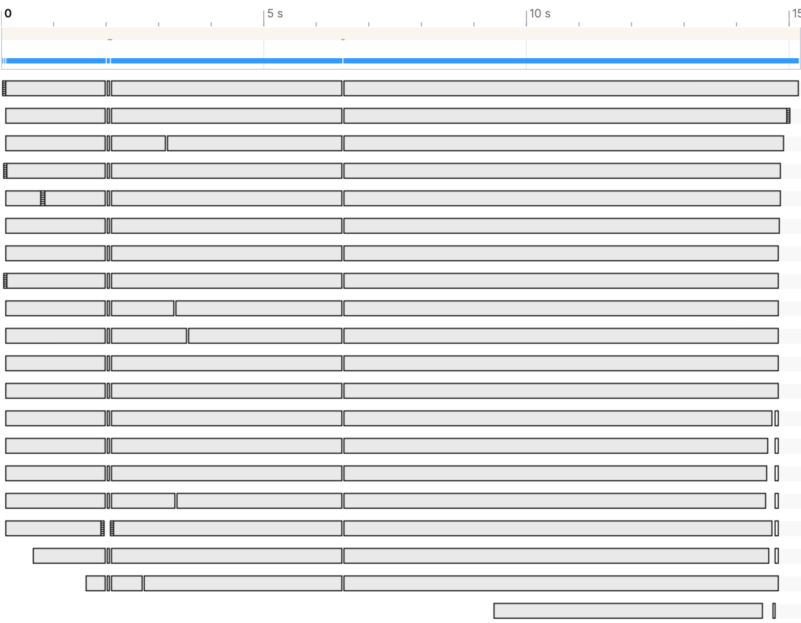

## System Specs

2.4 GHz 8-Core Intel Core i9\
L2 Cache (per Core): 256 KB\
L3 Cache:	16 MB\
32 GB 2667 MHz DDR4\
Apple SSD AP0512N 512 GB\
Hyperthreading: *Off*

## Baseline C# Runtime

234,833ms (234.833s, 3m54s)\
7.47 GB in LOH\
GC time is ~17.5% of total time (41,096ms)\

## Pre-allocate Temperature List

233,307ms (233.307s, 3m53s) - 0.65% improvement over baseline

## Read into blocks of char arrays

253,976ms (253.976s, 4m14s) - 8.2% slower than baseline\
GC time is ~17.3% of total time (43,938ms)

## Read into blocks of byte arrays

372,823ms (372.823s, 6m13s) - 58.8% slower than baseline\
GC time is ~23% of total time (85,749ms)

## Read into blocks of byte spans

199,262ms (199.262s, 3m19s) - 15.1% improvement over baseline\
GC time is ~13% of total time (25,904ms)

## Read into blocks of char spans

166,898ms (166.898s, 2m46s) - 29.1% improvement over baseline\
GC time is ~7% of total time (11,683ms)

## Calculate temperature statistics on the fly

231,824ms (231.824s, 3m51s) - 1.3% improvement over baseline\
Heap bounces between 380 MB and 770 MB in LOH\
GC time is ~6.7% of total time (15,532ms)

Benchmark of `TryGetValue` + `Add` on `SortedDictionary` vs `Dictionary`:

| Method                        | Mean      | Error    | StdDev   | Ratio | Gen0   | Gen1   | Allocated | Alloc Ratio |
|------------------------------ |----------:|---------:|---------:|------:|-------:|-------:|----------:|------------:|
| TryGetValue_SortedDictionary  | 108.24 us | 1.934 us | 1.809 us |  1.00 | 2.6855 | 0.1221 |   22.7 KB |        1.00 |
| TryGetValue_RegularDictionary |  13.77 us | 0.262 us | 0.367 us |  0.13 | 2.6550 |      - |  21.79 KB |        0.96 |

## Use Dictionary over SortedDictionary when gathering data

154,939ms (154.939s, 2m34s) - 34.1% improvement over baseline

## Use custom temperature parsing

95,168ms (95.168s, 1m35s) - 59.4% improvement over baseline

## Rent array blocks instead of allocating new ones

Before:

Heap bounces between 390 MB and 1.26 GB in LOH\
GC time is 13.4% of total time (12,753ms)

After:

82,026ms (82.026s, 1m22s) - 65.1% improvement over baseline\
Heap stays constant around 390 MB in LOH\
GC time is 15.2% of total time (12,468ms)

## Process each block in parallel

(21192ms + 19334ms + 20424ms) / 3 = 20316.67ms (20.31667s, 20s) - 91.3% improvement over baseline\

Heap grows to 20 GB in LOH\
GC time is 57.3% of total time (13,374ms)

## Use custom Dictionary to prevent String creations

(19243ms + 18763ms + 19988ms) / 3 = 19331ms (19.331s, 19s) - 91.8% improvement over baseline\

Heap grows to 8.14 GB in LOH\
GC time is 0.25% of total time (48ms)

## Read into blocks of byte spans (Attempt 2)

(11539ms + 11339ms + 11762ms) / 3 = 11547ms (11.5s) - 95.1% improvement over baseline\
Heap grows to 8.65 GB in LOH\
GC time is 0.65% of total time (60ms)

## Read blocks in parallel, use unmanaged memory, merge stats as tasks complete

(8602ms + 9017ms + 9019ms) / 3 = 8879.33ms (8.88s) - 96.2% improvement over baseline\
Heap grows to 1.35 GB in unmanaged memory\
GC time is 0.38% of total time (33.7ms)

## Run with 10K unique city names

Baseline: 364,729ms (364.7s, 6m5s)\
Final optimizations: 30,975ms (31s) - 91.26% improvement over baseline

## GCP VM Testing

| VM Machine Type | OS                  | CPU                       | RAM   | HDD Type | Run 1  | Run 2  | Run 3  | Run 4  | Run 5  | Avg (ms) | Avg (s) | $ / mo   | Compute Cost |
|-----------------|---------------------|---------------------------|-------|----------|--------|--------|--------|--------|--------|----------|---------|----------|--------------|
| N2D             | Ubuntu 22.04        | AMD EPYC Milan (2.45 GHz) | 64 GB | Balanced | 8094ms | 8170ms | 8395ms | 8322ms | 8116ms | 8223.4   | 8.22    | $508.43  | $0.0001324   |
| N2D             | Ubuntu 22.04        | AMD EPYC Milan (2.45 GHz) | 64 GB | SSD      | 7881ms | 7971ms | 7951ms | 7966ms | 7971ms | 7948.0   | 7.95    | $518.93  | $0.0001307   |
| N2D             | Windows Server 2022 | AMD EPYC Milan (2.45 GHz) | 64 GB | Balanced | 6730ms | 6981ms | 7111ms | 6866ms | 6813ms | 6900.2   | 6.90    | $1045.71 | $0.0002286   |
| C3D             | Ubuntu 22.04        | AMD EPYC Genoa (2.6 GHz)  | 64 GB | Balanced | 7298ms | 7225ms | 7195ms | 7163ms | 7192ms | 7214.6   | 7.21    | $545.26  | $0.0001246   |
| C3D             | Ubuntu 22.04        | AMD EPYC Genoa (2.6 GHz)  | 64 GB | SSD      | 7298ms | 7198ms | 7173ms | 7294ms | 7118ms | 7216.2   | 7.22    | $555.76  | $0.0001272   |
| C3D             | Windows Server 2022 | AMD EPYC Genoa (2.6 GHz)  | 64 GB | Balanced | 6347ms | 6376ms | 6219ms | 6365ms | 6597ms | 6380.8   | 6.38    | $1082.54 | $0.0002189   |

## My Solution vs. Fastest Solution

Fastest solution: 2.575s\
My solution: 10.973s
